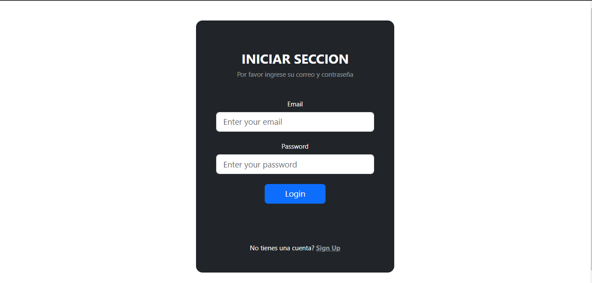
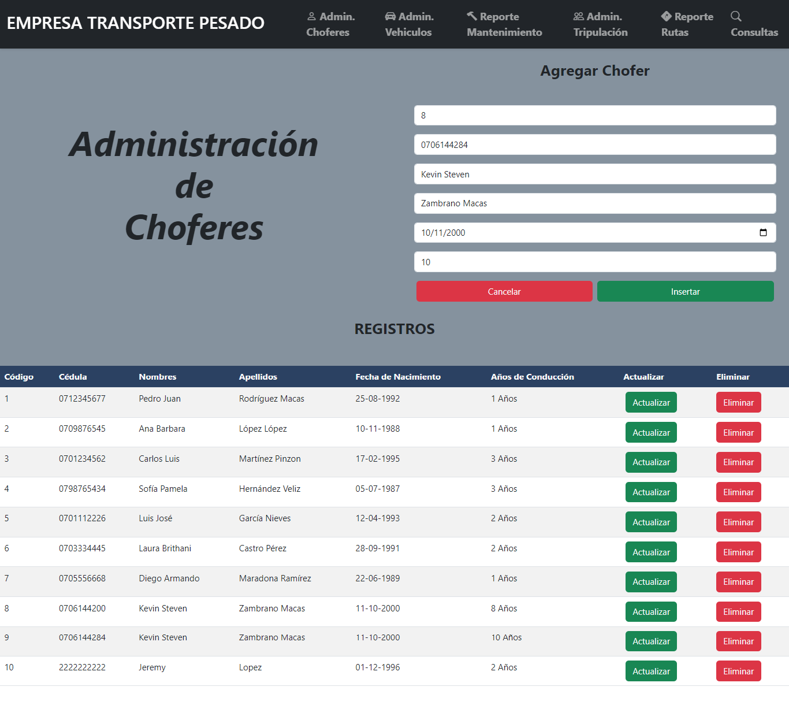
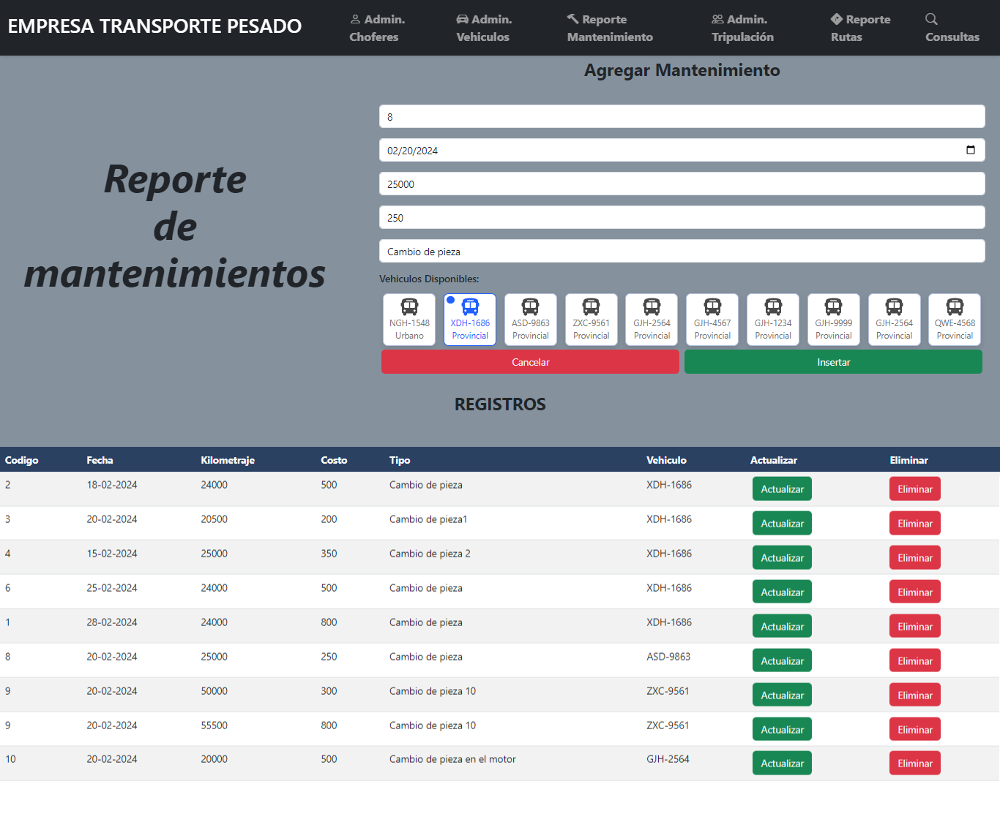
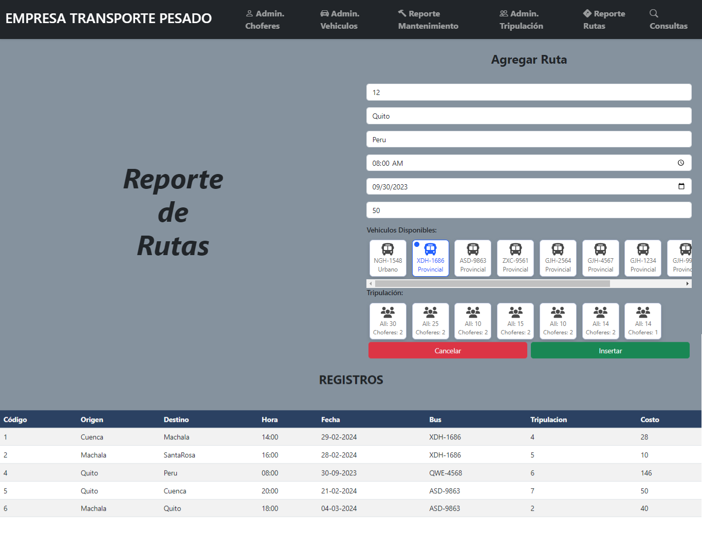

# Transporte-Pesado-WebApp

Using a API REST in a web application

**Installation and Usage**
Download the API REST repo
```
git clone -b milton2 https://github.com/JeremyPSS/API-mongo-nodejs-js.git
```

Download this repo
```
git clone https://github.com/JeremyPSS/Heavy-Transport-WebApp
```

Then 
1. Run `npm start` in the API REST first
2. Then `npm start` in the webapp

**Screenshots**



